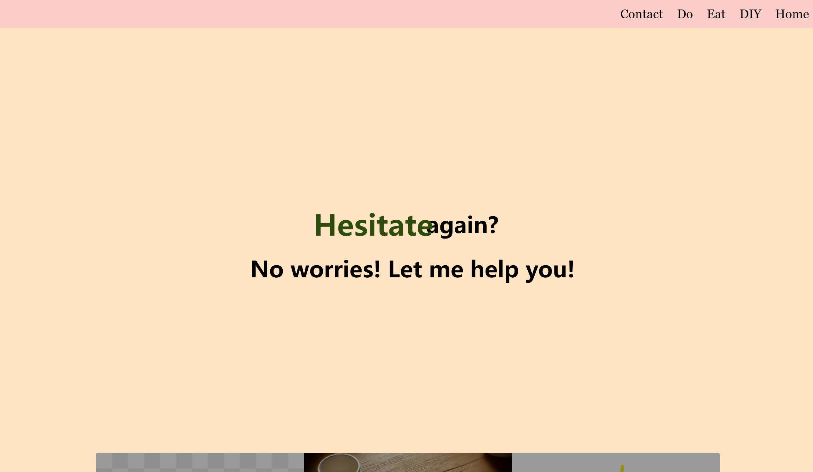
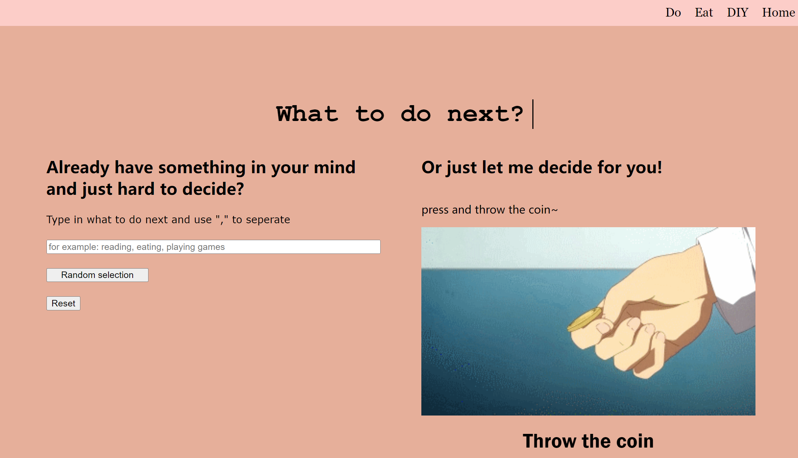

# final project description
## link: https://yuuuuu14.github.io/final/
### summary:
1. short one: help people make choices
2. detailed one: The target users of this project are people who feel anxious when making a decision in daily life, maybe because they don't want to be responsible for the possible good/bad result of the choice they made, or maybe there are so many choices in the daily life. The website will provide a relaxing and interesting way to relieve their psychological burden and make the process of "choice" fun, interesting and even a bit of ritual.What you would add next if you had more time
### Screenshot/display

p.s.: The word "Hesitate" has animation so it looks bigger than other words. 

### code snippet
        
- function explanation: Those above are the part I put in the "do" page, which is the "throw coin" button. After the user click the gif I put here, there would be a gif playing the action of throwing a coin, and the result would appear. The result is randomly selected among the database I created. 
- code explanation: I first created the database, and then I link the button function to the gif(which I also linked in the html before), everytime I click the gif, the function of playing the gif and the randomly selection would function at the same time. The random selection is made by randomly select the number of the result's position and order(database length) in my database. 

            
### struggle with 
1. The layout in the "do" page, it takes my a lot of time to fix it in order to make each of part occupied 50 percent and adding the suitable padding. I finally solve it bying using two div "right" and "left". This seems simple but it was hard for me to realize at the first time. But there are also some small problems come out after I created these two div, while I solve them in the end. 
### Proud of
1. The throw coin button. I think it adds a sense of ceremony to the choice making, especially when you leave it to fate. 
2. The second thing I am proud of is that I manually type all the database that I used for my random selection since I need to customize the categories (e.g. breakfast/lunch/dinner).
### Add next time
1. I want to build a more realistic typewriter effect in "DIY" page, since the headline sentence is very long. I want to make each line of text is ended typing before the next line of typing begins, which just like the real typing. At the same time, the black vertical cursor is always located after the last character of the current input line.
2. I also want to add the users input part in "eat" page, let the users could create their own food list like using the grocery list. Users could easily add or delete the items from the list and save their lists locally. The result would be randomly selected among their lists every time they click the button. 
